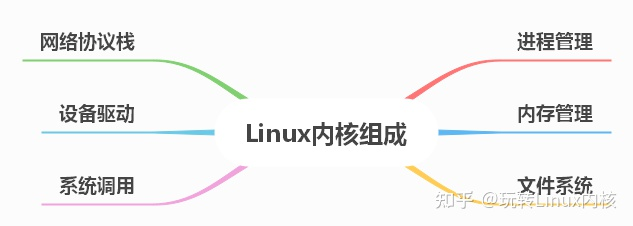
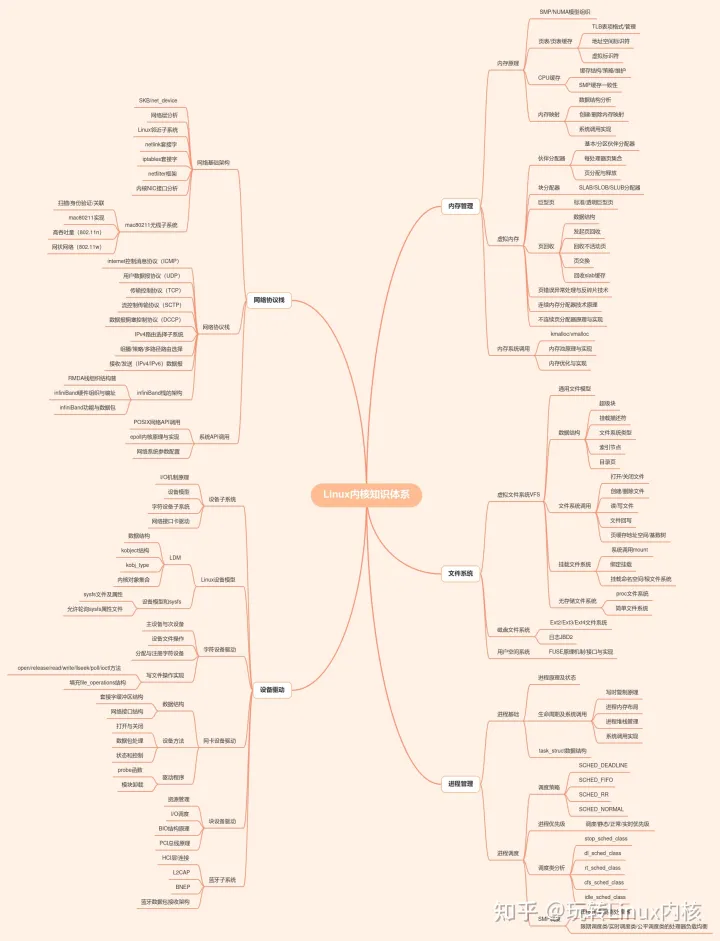

## 一，Linux内核组成

Linux内核主要由 **进程管理**、**内存管理**、**设备驱动**、**文件系统**、**网络协议栈** 外加一个 **系统调用**。  
  

## 二，源码组织结构

## 三，Linux内核知识体系

### **(1)内存管理**

内存原理

-   SMP/NUMA模型组织
-   页表/页表缓存
-   CPU缓存
-   内存映射

-   虚拟内存

-   伙伴分配器
-   块分配器
-   巨型页
-   页回收
-   页错误异常处理与反碎片技术
-   连续内存分配器技术原理
-   不连续页分配器原理与实现

-   内存系统调用

-   kmalloc/vmalloc
-   内存池原理与实现
-   内存优化与实现

### (2)**文件系统**

-   虚拟文件系统VFS

-   通用文件模型
-   数据结构
-   文件系统调用
-   挂载文件系统
-   无存储文件系统

-   磁盘文件系统

-   Ext2/Ext3/Ext4文件系统
-   日志JBD2

-   用户空间系统

-   FUSE原理机制/接口与实现

### (3)**进程管理**

-   进程基础

-   进程原理及状态
-   生命周期及系统调用
-   task\_struct数据结构

-   进程调度

-   调度策略
-   进程优先级
-   调度类分析
-   SMP调度

### （4)网络协议栈

-   网络基础架构

-   SKB/net\_device
-   网络层分析
-   Linux邻近子系统
-   netlink套接字
-   iptables套接字
-   netfilter框架
-   内核NIC接口分析
-   mac80211无线子系统

-   网络协议栈

-   internet控制消息协议（ICMP）
-   用户数据报协议（UDP）
-   传输控制协议（TCP）
-   流控制传输协议（SCTP）
-   数据报拥塞控制协议（DCCP）
-   IPv4路由选择子系统\*
-   组播/策略/多路径路由选择
-   接收/发送（IPv4/IPv6）数据报
-   infiniBand栈的架构

-   系统API调用

-   POSIX网络API调用
-   epoll内核原理与实现
-   网络系统参数配置

### (5)**设备驱动**  

-   设备子系统

-   I/O机制原理
-   设备模型
-   字符设备子系统
-   网络接口卡驱动

-   Linux设备模型

-   LDM
-   设备模型和sysfs

-   字符设备驱动

-   主设备与次设备
-   设备文件操作
-   分配与注册字符设备
-   写文件操作实现

-   网卡设备驱动

-   数据结构
-   设备方法
-   驱动程序

-   块设备驱动

-   资源管理
-   I/O调度
-   BIO结构原理
-   PCI总线原理

-   蓝牙子系统

-   HCI层/连接
-   L2CAP
-   BNEP
-   蓝牙数据包接收架构